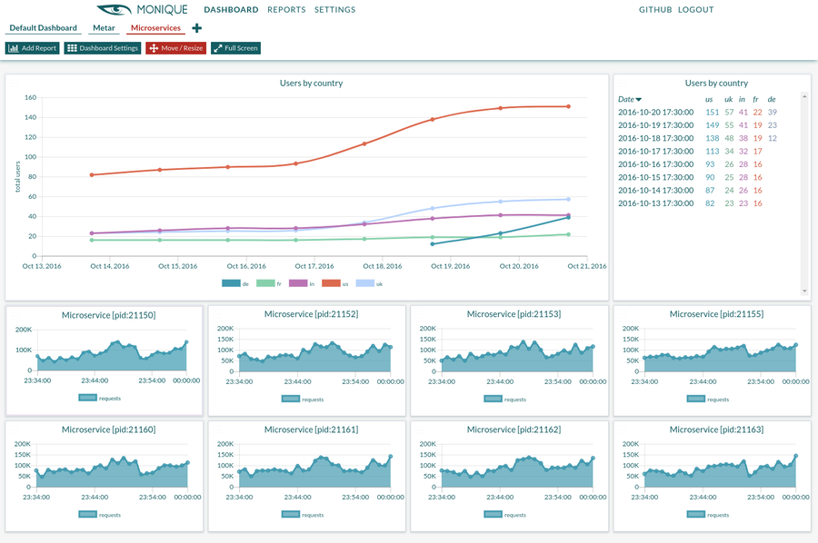

.. figure:: images/monique-dashboards-logo.png

**Monique Dashboards** is an innovative Python library for creating dashboard and monitoring
applications, coming with sample web and API applications `Monique Web <https://github.com/monique-dashboards/monique-web>`_ and `Monique API <https://github.com/monique-dashboards/monique-api>`_. The library replaces the traditional
concept of a **metric** with a **table** and provides auto-parsing of multiple input formats,
like JSON, ASCII tables, CSV files.

Please refer to the `Github page <https://github.com/monique-dashboards/monique>`_ for a more complete
overview.

.. toctree::
   :maxdepth: 4
   :caption: Contents:

   installation
   tutorial
   layouts
   sscreator
   tpcreator
   tilewidgets
   reports
   dataseries
   other
   reference

Indices and tables
==================

* :ref:`genindex`
* :ref:`modindex`
* :ref:`search`
